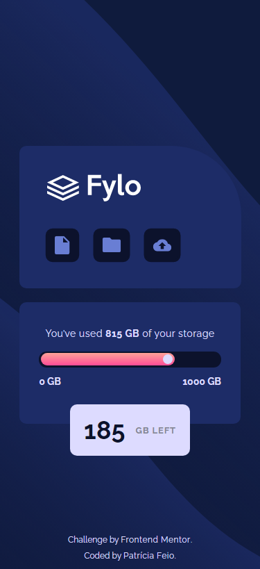
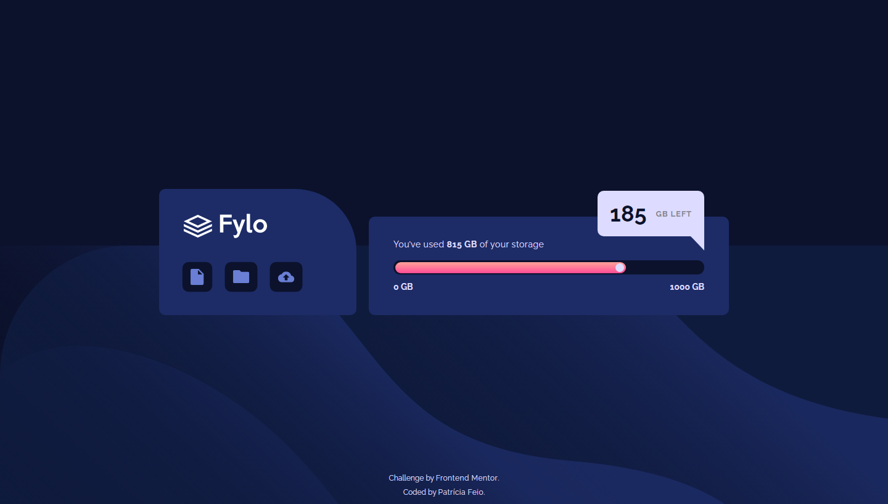

# Frontend Mentor - Fylo data storage component

## Welcome! 👋

Thanks for checking out this front-end coding challenge.

[Frontend Mentor](https://www.frontendmentor.io) challenges allow you to improve your skills in a real-life workflow.

## The challenge

My challenge was to build out this data storage component and get it looking as close to the design as possible.

The users should be able to:

- View the optimal layout for the site depending on their device's screen size

### Screenshots

Mobile (375px)

Desktop (1440px)

### Links

- Solution URL: [my solution](https://www.frontendmentor.io/solutions/fylo-data-storage-component-using-flexbox-and-sass-vjvXWWlYc)
- Live Site URL: [Fylo data storage component](https://fylo-data-storage-comp.vercel.app/)

### Built with

- Semantic HTML5 markup
- Sass
- Flexbox
- Mobile-first workflow

## Author

- Website - [Patrícia Feio](https://patriciafeio.github.io/)
- Frontend Mentor - [@PatriciaFeio](https://www.frontendmentor.io/profile/PatriciaFeio)
